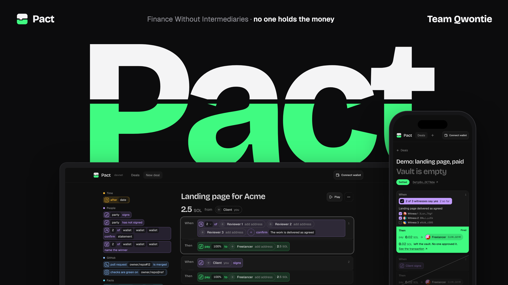

# Pact

Pay for work with the money already locked. Pact keeps the payment for a gig or a bounty in an on-chain vault and releases it by rules everyone can read: reviewer votes, a signature or a date. No intermediary, no admin key, no fee. Live on Solana devnet: https://pact.qwontie.dev

## Build

```sh
make setup          # Rust, Solana CLI, Anchor, Surfpool, bun
make test           # program tests on Surfpool
make dev            # web app on http://localhost:5173
```

Production on mainnet: [DEPLOYMENT.md](DEPLOYMENT.md).

## Team

Built by team Qwontie at HackYeah 2026 for the "Finance Without Intermediaries" challenge by Superteam Poland. The code was written by AI agents led by the four of us.
